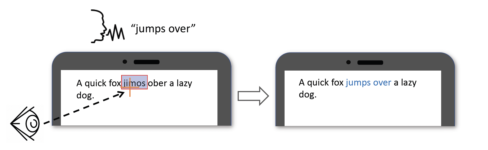

# EyeSayCorrect: Eye Gaze and Voice Based Hands-free Text Correction for Mobile Devices

## Video Demo 

<iframe width="560" height="315" src="//player.bilibili.com/player.html?bvid=BV1244y1W7jt&page=1" scrolling="no" border="0" title="EyeSayCorrect Demo" frameborder="no" framespacing="0" allowfullscreen="true"> </iframe>

## Abstract
Text correction on mobile devices usually requires precise and repetitive manual control. In this paper, we present EyeSayCorrect, an eye gaze and voice based hands-free text correction method for mobile devices. To correct text with EyeSayCorrect, the user first utilizes the gaze location on the screen to select a word, then speaks the new phrase. EyeSayCorrect would then infer the user's correction intention based on the inputs and the text context. EyeSayCorrect can accommodate ambiguities and noisy input signals. We used a Bayesian approach for determining the selected word given an eye-gaze trajectory. Given each sampling point in an eye-gaze trajectory, the posterior probability of selecting a word is calculated and accumulated. The target word would be selected when its accumulated interest is larger than a threshold. The misspelled words have higher priors. Our first user study proved that using priors for misspelled words reduced the task completion time by 9.26% for large font size (28 pt) and by 23.79% for small font size (14 pt). The subjective ratings are also in favor of the method with priors. Our second user study compared the touch-only method with EyeSayCorrect with priors. The touch-only method took 61.23% and 64.49% task completion times of EyeSayCorrect for large and small font sizes.  Although EyeSayCorrect is less efficient than the touch-only method, it does not require acquaintance of the QWERTY keyboard layout, synergistically utilizes the advantages of eye gaze and voice modalities, enables hands-free text correction on mobile devices.

## Publication (preprint)
[pdf](EyeSayCorrect_camera_ready.pdf)
## Contact
For questions and further information, please contact:
Maozheng Zhao  Email: maozheng.zhao@stonybrook.edu

